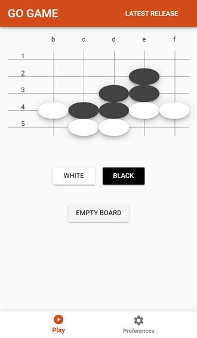
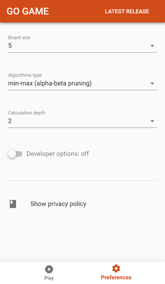
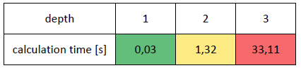
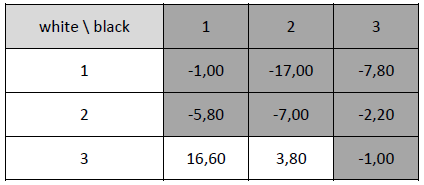

# Go Game

* [Used technologies](#used-technologies)
* [Game description](#game-description)
* [How the algorithm works](#how-the-algorithm-works)
  * [Min-max algorithm](#min-max-algorithm)
  * [Min-max algorithm with alpha-beta pruning](#min-max-algorithm-with-alpha-beta-pruning)
* [Description of chosen evaluation function](#description-of-chosen-evaluation-function)
* [Description of chosen available move generation function](#description-of-chosen-available-move-generation-function)
* [Test the implementation of min-max algorithm playing against each other](#test-the-implementation-of-min-max-algorithm-playing-against-each-other)
* [To do](#to-do)
* [Contribution](#contribution)
* [Project setup through Vue GUI CLI](#project-setup-through-vue-gui-cli)
* [Project setup (instead of Vue GUI CLI)](#project-setup-instead-of-vue-gui-cli)

You can play here https://orzechdev.github.io/go-game or you can add app to the main screen of mobile phone and play also offline.

 

## Used technologies
* JavaScript
* [Vue.js](https://github.com/vuejs/vue)
* [Vuetify](https://github.com/vuetifyjs/vuetify)
* [Vuex](https://github.com/vuejs/vuex)
* [Vue Router](https://github.com/vuejs/vue-router)
* [PWA](https://en.wikipedia.org/wiki/Progressive_web_applications)

## Game description

In this application you can play against computer in Go Game - probably the oldest board game invented in China. 

Ths application has implemented AI algorithm called min-max. One can start playing against it by selecting board size and calculation depth (the depth of min-max tree). I hope some functionality will be added later and the algorithm will be improved.

What are the rules of game?

Go is strategy board game for two players, played on an e.g. 9×9 grid. One player has the dark pieces; the other has the light pieces. Players take turns placing pieces of their own color on a vacant point (intersection) of the grid. Black plays first. Vertically and horizontally adjacent stones of the same color form a chain that cannot subsequently be subdivided and, in effect, becomes a single larger stone. Only stones immediately connected to one another by the lines on the board create a chain; stones that are diagonally adjacent are not connected. Chains may be expanded by placing additional stones on adjacent intersections, and can be connected together by placing a stone on an intersection that is adjacent to two or more chains of the same color. A vacant point adjacent to a stone is called a liberty for that stone. Stones in a chain share their liberties. A chain of stones must have at least one liberty to remain on the board. When a chain is surrounded by opposing stones so that it has no liberties, it is captured and removed from the board. The goal of this game is to have the biggest territory covered with players stone.

To read more about the rules behind the game please refer 
[wikipedia article](https://en.wikipedia.org/wiki/Go_(game)).

## How the algorithm works

### Min-max algorithm

After the user place his/her stone, the computer evaluates its best possible move (let’s say first player), but in order to do so, previously calculates best possible move for opponent (second player). If depth of calculations is not yet reached, before calculating second player move, next first player best move is calculated. This procedure is done again and again until depth is reached.
The parameters on which algorithm depends are: current node state of board, depth of calculations and player’s stone color.

To learn more please refer [wikipedia article](https://en.wikipedia.org/wiki/Minimax).

### Min-max algorithm with alpha-beta pruning

This is generally the same as in min-max, with small extension. If e.g. there exist in currently considered children of some parent node such an outcome worse than it was in children of previously considered children of previous parent node, than stop considering another siblings nodes as the whole parent node is now considered worse than previous parent node, i.e. this parent node / this strategy will not be taken at all and all the children of it doesn’t matter now.

To learn more please refer [wikipedia article](https://en.wikipedia.org/wiki/Alpha%E2%80%93beta_pruning).

## Description of chosen evaluation function

Function returns how many points each user have, i.e. for each player it is the sum of:
* number of stones inserted on the board by given player
* number of empty intersections which are surrounded from every direction (top, right, bottom, left) with just given player’s stones (or extremities of the board)

## Description of chosen available move generation function

Function returns all the available moves (i.e. intersections where stone might be inserted). These moves satisfy, that
* every intersection is empty
* every intersection in not surrounded from every direction (top, right, bottom, left) with just opponent stones (or extremities of the board) as it would be immediately removed
* due to the long calculations time I assumed the stone must be placed somewhere where it has at least one opponent’s stone as neighbor (these possibilities, which here, with quite simple evaluation function leads to same outcome – thus not many sense to calculate them -> less calculations less time spend on them)

## Test the implementation of min-max algorithm playing against each other

I assumed player with black stones starts (placing first stone in random intersection). If there is tie (players has equal number of points), then player with white stones should be a winner (Komi rule is not applied, so player with white stones is in worse situation).

Manual tests show increase of strategic thinking in algorithm and choosing better moves as depth of calculation increases (i.e. number of min-max calculations for both players), what causes more difficult to beat algorithm. Nevertheless, it still reveals no considering big strategy plan, so moves sometimes seems to be stupid and repeated for experienced player.

Unfortunately, as min-max calculation depth increases, the time of these calculations also increases.

Mean calculation times for 5 games for given depth:



Mean value of points player with white stones obtained for 5 games for given players' depths (this is zero-sum game, thus positive outcomes for player with white stones are negative for player with black stones and vice versa) 

White/black colors represents if mean outcome >= 0, then player with white stones mainly win, if mean outcome < 0, then player with black stones mainly win:



## To do

- Fix alpha-beta pruning for min-max algorithm, as it doesn't work correctly.
- Rewrite algorithms' code into code which operates on bits instead of arrays of integers - processor would operate on them much more faster.
- Refactor code
- Implement [Monte-Carlo Tree Search](https://en.wikipedia.org/wiki/Monte_Carlo_tree_search) ???
- Multiplayer offline as well as online.

## Contribution

Feel free to contribute to this application - no hesitate to contact with me and make pull request!

## Project setup through Vue GUI CLI
```
vue ui
```

## Project setup (instead of Vue GUI CLI)
```
yarn install
```

### Compiles and hot-reloads for development
```
yarn run serve
```

### Compiles and minifies for production
```
yarn run build
```
In order to let working web app with app on Google Play remember to check if following files exists in dist and on branch gh-pages:
* (due to Github pages do not include dot files) empty `.nojekyll`
* (due to Github pages do not include dot files) `_config.yml` with:
```
include: [".well-known", "launch.json"]
```
* `.well-known/assetlinks.json` with:
```
[{
  "relation": ["delegate_permission/common.handle_all_urls"],
  "target" : { "namespace": "android_app", "package_name": "com.orzechdev.gogame",
               "sha256_cert_fingerprints": ["CB:78:1F:3D:E5:09:64:EE:86:B6:A3:3F:B0:00:65:CF:67:1B:54:FB:60:0F:81:0A:C0:3A:C8:C6:48:86:0E:F9"] }
}]
```
* `privacy-policy-google-play.html` rferenced on Google Play listing 


### Run your tests
```
yarn run test
```

### Lints and fixes files
```
yarn run lint
```

### Customize configuration
See [Configuration Reference](https://cli.vuejs.org/config/).
